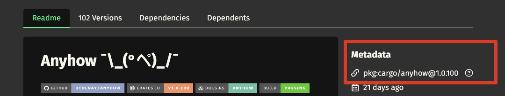

# pollux

> Get trusted publishing and build reproducibility insights for any Rust supply chain 🦀

## What

`pollux` is a CLI tool that provides trust factors insights for Rust supply chains.

It consumes and aggregates information on
[trusted publishing](https://crates.io/docs/trusted-publishing/)
adoption and
[build reproducibility](https://reproducible-builds.org)
within the
[crates.io](https://crates.io)
ecossystem, so one can easily get visibility on those aspects for any Rust project
or crate.

`pollux` takes inspiration from previous art on the subject, specifically:

- [999 crates on the wall](https://lawngno.me/blog/2024/06/10/divine-provenance.html)
- [Are we pep740 yet](https://trailofbits.github.io/are-we-pep740-yet/)

and uses public data provided by the
[crates.io](https://crates.io/data-access)
and the
[oss-rebuild](https://oss-rebuild.dev)
projects.

## A report on popular crates

Curious to see check the adoption of trusted publishing amongst the most downloaded
crates? We provide a
[report on that](https://dotanuki-labs.github.io/pollux/),
which updates automatically every time a new commit lands on this repository.

`oss-rebuild` has been working on improving build reproducibility coverage across
the Rust ecosystem, hence those numbers must increase over time. Please follow
[this issue](https://github.com/google/oss-rebuild/issues/652)
to learn more about

## Installing

You build from the latest `HEAD` commit with

```bash
cargo install --git https://github.com/dotanuki-labs/pollux
```

## Using

> [!WARNING]
> To honor `crates.io` rate limits, all HTTP requests to `crates.io/api/*`
> are queued internally and follow a strict 1.0s (one second) delay between
> API calls. This means that some commands may take a few minutes to complete,
> especially when analysing large projects with lots of transitive dependencies

### Checking standalone crates

You can check a standalone crate version by running

```bash
pollux check <package-url>
```

For now, `pollux` accepts only a
[package url](https://github.com/package-url/purl-spec)
as a precise definition for a crate artifact. You can find a `purl` for any crate version
directly at crates.io website, just click to copy it!



If you want to generate a report checking trust factors the most downloaded crates, that's
also simple:

```bash
pollux inquire --output <html, console> --coverage <small, medium, large, huge>
```

For instance, the companion reported hosted at Github pages is generated by

```bash
pollux inquire --output html --coverage large
```

`pollux` defines a fixed amount of popular crates to check according to
the `coverage` argument, namely:

- `small` : top 100 most downloaded crates
- `medium` : top 500 most downloaded crates
- `large` : top 1000 most downloaded crates
- `huge` : top 5000 most downloaded crates

### Analysing transitive dependencies

Unlike `check`, the `analyse` subcommand dives into transitive dependencies of a given
crate version, and evaluates everything tracked within a `Cargo.lock` file. If such file is
missing, `pollux` will generate one on the fly.

```bash
pollux analyse crate <package-url>
```

The output of such an execution should be something like

```text
pollux analyse crate pkg:cargo/serde@1.0.226

Analysing packages. This operation may take some time ...

Statistics :

• total packages analysed : 6
• with trusted publishing attested : 0
• with reproducible builds : 0

Veracity factors :

• pkg:cargo/proc-macro2@1.0.101 (none)
• pkg:cargo/quote@1.0.40 (none)
• pkg:cargo/serde_core@1.0.226 (none)
• pkg:cargo/serde_derive@1.0.226 (none)
• pkg:cargo/syn@2.0.106 (none)
• pkg:cargo/unicode-ident@1.0.19 (none)
```

`pollux` can also analyse any Rust project on your filesystem

```bash
pollux analyse project <path>
```

generating a similar output.

In order to speed-up subsequental executions, `pollux` caches all evidence on
trusted publishing and build reproducibility at `$HOME/.pollux`.

## Contributing

Please check [our docs](https://github.com/dotanuki-labs/pollux/tree/main/docs)

## License

Copyright (c) 2025 - Dotanuki Labs - [The MIT license](https://choosealicense.com/licenses/mit)
